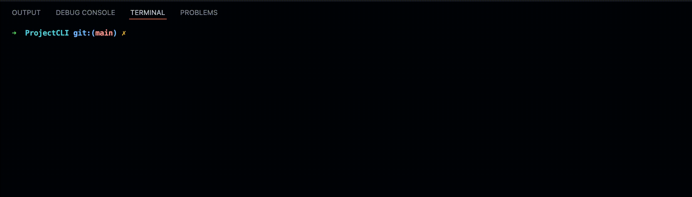

# Project CLI

## Super Fast

## Made With GO

## Uses Python To Set Up

## Multi-Platform

</video>

## Has 2 starter projects

- Discord-JS(NodeJS)
- Chatbot(Python)

# Installation

Using the command go command line to install is the preferred way

```sh
go install github.com/NotTimIsReal/project-maker

```

Manually Compiling can be done but is not recommended.

## Usage

### Building

Start by running `project-maker`, this should show you your available command.

Runnng `project-maker build <project-name>` will build the project.

Let's try making a chatbot.

We'd first run `project-maker build python-chatbot <dirname>`

Obviously replace `<dirname>` with a directry

This Should Clone And Install The Required Dependencies And If It Fails It Will Exit.

### Making Your Own Project

The code uses git to clone and get the projects so you'd need to upload your template up into github or gitlab. You also need a python file called `project-setup.py` in order to run the setup part of the build command. A `project-setup.py` file should look like so:

```py
import subprocess
#quit if stderr
cmd= subprocess.getstatusoutput("yarn -v") # checks if yarn is installed
if cmd[0] != 0:
    print("Yarn Is Not Installed")
    quit(1)
    # if not quit
status=subprocess.call(["yarn", "install"], stdout=subprocess.DEVNULL, stderr=subprocess.DEVNULL) # Installs the dependencies
if status != 0:
    print("Yarn Error")
    quit(1)
    #If error is thrown quit
print("setup.project.status.sucess")
# Always print setup.project.status.sucess when sucess

```

As seen in the example you need to print "setup.project.status.sucess" for the tool to end successfully. It is recommended to also use subprocess rather than `os.system`. In order for a more cleaner output make sure any stdout and stderr are sent to subprocess.DEVNULL like in the example.

Then Upload Your Code To A https Git server such as github or gitlab.

Then Run `project-maker new <project-name> <project-url>`

This will locally save that project.

And To Build it you run `project-maker build <project-name> <dir-name>`

# Credits

- NotTimIsReal - Creator of the project
